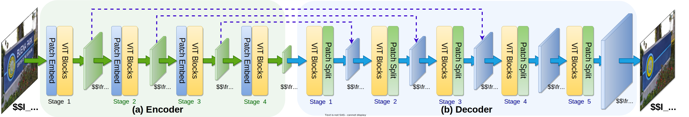
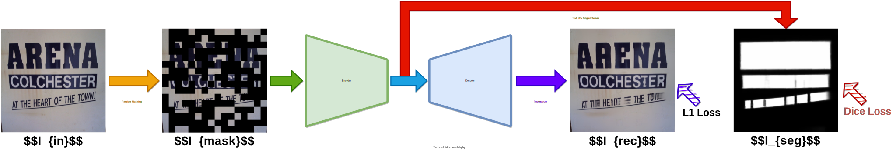

# ViTEraser (AAAI 2024)

The official implementation of [ViTEraser: Harnessing the Power of Vision Transformers for Scene Text Removal with SegMIM Pretraining](https://arxiv.org/abs/2306.12106) (AAAI 2024). 
The ViTEraser revisits the conventional single-step one-stage framework and improves it with ViTs for feature modeling and the proposed SegMIM pretraining. 
Below are the frameworks of ViTEraser and SegMIM.




## Todo List
- [x] Inference code and model weights 
- [x] ViTEraser training code 
- [ ] SegMIM pre-training code

## Environment
We recommend using [Anaconda](https://www.anaconda.com/) to manage environments. Run the following commands to install dependencies.
```
conda create -n viteraser python=3.7 -y
conda activate viteraser
pip install torch==1.8.2 torchvision==0.9.2 torchaudio==0.8.2 --extra-index-url https://download.pytorch.org/whl/lts/1.8/cu111
git clone https://github.com/shannanyinxiang/ViTEraser.git
cd ViTEraser
pip install -r requirements.txt
```

## Dataset 

- SCUT-EnsText [[paper]](https://ieeexplore.ieee.org/document/9180003): 

  1. Download the training and testing sets of SCUT-EnsText at [link](https://github.com/HCIILAB/SCUT-EnsText).
  2. Rename `all_images` and `all_labels` folders to `image` and `label`, respectively.
  3. Generate text masks: 
  ```
    # Generating masks for the training set of SCUT-EnsText
    python tools/generate_mask.py \
      --data_root data/TextErase/SCUT-EnsText/train    

    # Generating masks for the testing set of SCUT-EnsText
    # Masks are not used for inference. Just keep the same data structure as the training stage.
    python tools/generate_mask.py \
      --data_root data/TextErase/SCUT-EnsText/test
  ```

Please prepare the above datasets into the `data` folder following the file structure below.

```
data
└─TextErase
   └─SCUT-EnsText
      ├─train
      │  ├─image
      │  ├─label
      │  └─mask
      └─test
         ├─image
         ├─label
         └─mask
```

## Models

The download links of pre-trained ViTEraser weights are provided in the following table.

| Name | BaiduNetDisk | GoogleDrive|
| -    |  -   |   -   |
| ViTEraser-Tiny | [link](https://pan.baidu.com/s/1EOFRUXh87vm7MpxBlRqgeg?pwd=3evn) | [link](https://drive.google.com/file/d/1f6Awu37YD7A4VC8gIvZHmLtk5wqJlSQi/view?usp=drive_link) | 
| ViTEraser-Small | [link](https://pan.baidu.com/s/1ze-B8rYDYOhZ9zHAp77N3A?pwd=47mr) | [link](https://drive.google.com/file/d/1JDaallum-Z1iZ8GULimz4OaQjfVRKP5i/view?usp=drive_link) | 
| ViTEraser-Base | [link](https://pan.baidu.com/s/1G26NsjI_pcUWKdOqjMon0w?pwd=qurn) | [link](https://drive.google.com/file/d/1nvIN_HAR1LqIbmkSlWmtHIJjj3B9YEj4/view?usp=sharing) |

## Inference

The example command for the inference with ViTEraser-Tiny is:
```
CUDA_VISIBLE_DEVICES=0 \
python -m torch.distributed.launch \
        --master_port=3151 \
        --nproc_per_node 1 \
        --use_env \
        main.py \
        --eval \
        --data_root data/TextErase/ \
        --val_dataset scutens_test \
        --batch_size 1 \
        --encoder swinv2 \
        --decoder swinv2 \
        --pred_mask false \
        --intermediate_erase false \
        --swin_enc_embed_dim 96 \
        --swin_enc_depths 2 2 6 2 \
        --swin_enc_num_heads 3 6 12 24 \
        --swin_enc_window_size 16 \
        --swin_dec_depths 2 6 2 2 2 \
        --swin_dec_num_heads 24 12 6 3 2 \
        --swin_dec_window_size 16 \
        --output_dir path/to/save/output/ \
        --resume path/to/weights/
```

Argument changes for different scales of ViTEraser are as below:

| Argument | Tiny | Small | Base |
| - | - | - | - |
| swin_enc_embed_dim | 96 | 96 | 128 |
| swin_enc_depths | 2 2 6 2 | 2 2 18 2 | 2 2 18 2 |
| swin_enc_num_heads | 3 6 12 24 | 3 6 12 24 | 4 8 16 32 |
| swin_enc_window_size | 16 | 16 | 8 |
| swin_dec_depths | 2 6 2 2 2 | 2 18 2 2 2 | 2 18 2 2 2 |
| swin_dec_num_heads | 24 12 6 3 2 | 24 12 6 3 2 | 32 16 8 4 2 |
| swin_dec_window_size | 16 | 8 | 8 |

## Evaluation

The command for calculating metrics is:
```
python eval/evaluation.py \
    --gt_path data/TextErase/SCUT-EnsText/test/label/ \
    --target_path path/to/model/output/

python -m pytorch_fid \
    data/TextErase/SCUT-EnsText/test/label/ \
    path/to/model/output/ \
    --device cuda:0
```

## ViTEraser Training

### 1. Training without SegMIM pretraining

- Download the ImageNet-pretrained weights of Swin Transformer V2 (Tiny: [download link](https://pan.baidu.com/s/19v-qKJO4c0iK52y7Lx1Qgg?pwd=j8yj), Small: [download link](https://pan.baidu.com/s/1kLAA27KqPlTEZnLkxTjC2w?pwd=8rm6), Base: [download link](https://pan.baidu.com/s/1_UO_MGN-O4pXsekBP_YPxg?pwd=75bf), originally released at [repo](https://github.com/microsoft/Swin-Transformer)).
- Download the ImageNet-pretrained weights of VGG-16 ([download link](https://pan.baidu.com/s/13dS0Q55ydoF6zdGKxS1lkg?pwd=5scx), originally released by PyTorch).
- Put the pretrained weights into the `pretrained` folder.
- Run the example scripts in the `scripts/viteraser-training-wosegmim' folder.
For instance, run the following command to train ViTEraser-Tiny without SegMIM pretraining.
```
bash scripts/viteraser-training-wosegmim/viteraser-tiny-train.sh
```

### 2. Training with SegMIM pretraining

- Download the SegMIM pretraining weights for ViTEraser-Tiny ([download link](https://pan.baidu.com/s/1lqhWgpmrnxHbk1USRpSGtw?pwd=xr6a)), ViTEraser-Small ([download link](https://pan.baidu.com/s/16TcTOdwPAZnmUgk_SUR7Ag?pwd=i6zr)), or ViTEraser-Base ([download link](https://pan.baidu.com/s/1HGlb1xAfKykS8wp3FPwSIQ?pwd=frdq)).
- Download the ImageNet-pretrained weights of VGG-16 ([download link](https://pan.baidu.com/s/13dS0Q55ydoF6zdGKxS1lkg?pwd=5scx), originally released by PyTorch).
- Put the pretrained weights into the `pretrained` folder.
- Run the example scripts in the `scripts/viteraser-training-withsegmim' folder.
For instance, run the following command to train ViTEraser-Tiny with SegMIM pretraining.
```
bash scripts/viteraser-training-withsegmim/viteraser-tiny-train.sh
```

## Citation
```
@inproceedings{peng2024viteraser,
  title={ViTEraser: Harnessing the power of vision transformers for scene text removal with SegMIM pretraining},
  author={Peng, Dezhi and Liu, Chongyu and Liu, Yuliang and Jin, Lianwen},
  booktitle={Proceedings of the AAAI Conference on Artificial Intelligence},
  volume={38},
  number={5},
  pages={4468--4477},
  year={2024}
}
```

## Copyright
This repository can only be used for non-commercial research purpose.

For commercial use, please contact Prof. Lianwen Jin (eelwjin@scut.edu.cn).

Copyright 2024, [Deep Learning and Vision Computing Lab](http://www.dlvc-lab.net), South China University of Technology. 
